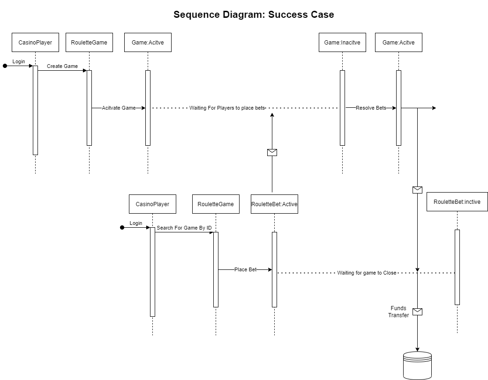
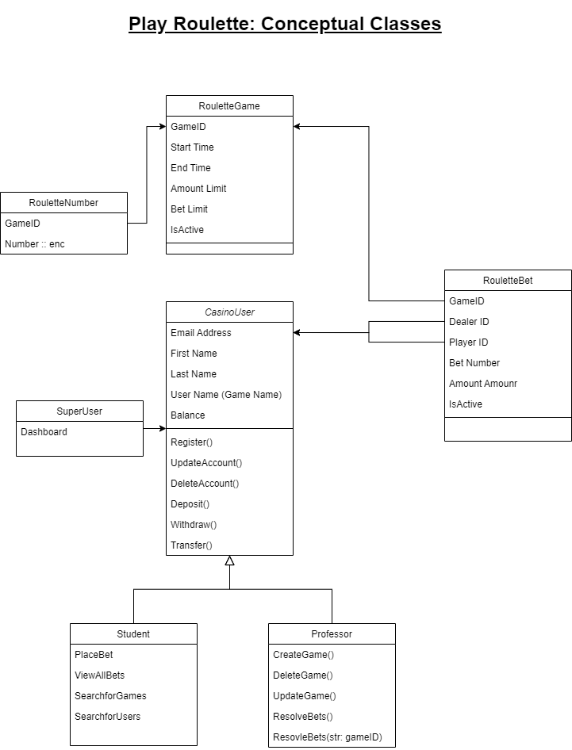
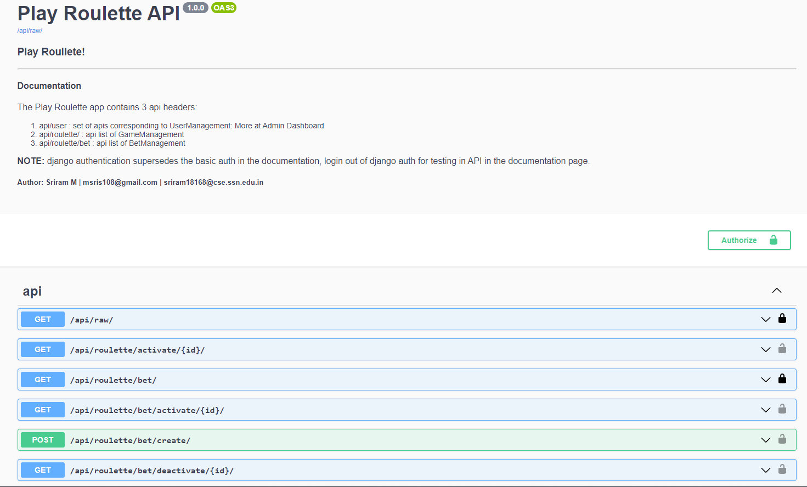
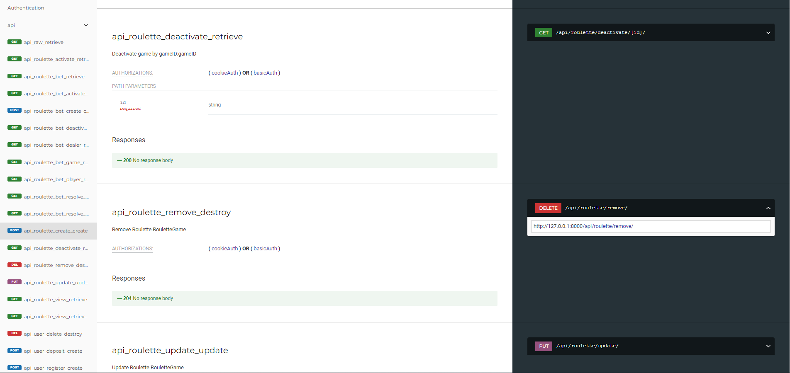

# Play Roulette
The model was built using Django (Django Rest Framework). Django uses a model-view-controller(template) architecture, this app was built keeping the best practices of the django-framework in mind. 

- The App protected from SQL injection attacks.
- The Data models are easily migratable.
- The App is documented according to the SwaggerUI and redocs standards.

## Requirements :
1. django-rest-framework
2. crpytogrphic-fields
3. drf-spectatcular (documentation)

## Data Models - Views
### **1. CasinoUser**
CasinoUser, which extends the DjangoUser class, consists the basic fuctionalities of the User (CRUD). The data model can be seen in [user/model.py](user/models.py). The API views can be seen in [user/views.py](user/views.py).3 types of users:
    1. Player
    2. Dealer
    3. SuperUser (admin)

- Players have the CRUD abilites and further more there are other important APIs for adding, withdrawing and transfering funds. The player can also place bets on games (more info on the game/bet section).
- Dealers has all the functionalities of the user along with the ability to manage games (more info on the game/bet section).
- SuperUser or AdminUser (admin@casino.com) has extensive dashboard priviliges from where he can manage all the users and games with all the necessary management tools.
- NOTE: test cases for minimum balance for withdrawal / transfer have been handled.
- NOTE: Passwords have been hashed and secured with SECTRET_KEY and is to be stored in the development enviornment.

### **2. RouletteGame**
The data model can be seen in PlayRoulette [roulette/model.py](roulette/models.py). The API views can be seen in [roulette/views.py](roulette/views.py). Roulette gameas represent the Game class. The permissions for the Game management have been limited to the user. This app also provides the extension of the permission to allow regular users to create and manage games with thier own funds! But the current permission set only allows for dealers to make games. The dealer can perform basic CRUD operations and can set the limits for the game like player limit and bet_amount limit. The dealer can activate and deactivitate the games at his own pace, games are also given a start_time and end_time, within which players are expected to place the bets. The Dealer has the ability to extend the deadlines using update game feature. The dealer can deactivate the game at any point of time.
- Basic CRUD operations
- Flexible Operations on Games
- NOTE: The checking of end_time has not been provided, a player is expected to place his bets before the closing time. But this condidtion was not added to give some more room for users and potentially increasing the profits. This feature can be easily added if the use case demands it.

**RouletteNumber**
The betting number corresponding to the game is stores in a separate class (database table) and the number is **encrypted**. The roulette number is associated with each game. The decrypted number can only be acccesed within the ORM.
> **NO OPEN API EXPOSES THE ROULETTE NUMBER OR THE ENCRYPTED ROULETTE NUMBER**

### **3. RouletteBet**
Bets can be made on every active RouletteGame by multiple users. The bets can be placed as long as the bets satisy the conditions. Once a bet is made it cannot be revoked or modified. The dealers can resolve the bets. Minimum dealer funds was not placed as it could severely restrict the number of bets, but the dealer can rebalance and resume the bet resolving. 
- The game is expected to be deactivated and the bets to be resolved, but say the game is active the game would be automatically deactivated.
- Dealers can resolve bets by gameID or can resolve all open bets.
- Once the bets are resolved the bet moves to inactive state and cannot be resolved again.

> Any issues with the bets can be manually manipulated ONLY by the SuperUser / AdminUser from his Dashboard

## Documentation

### Sequence Diagram

### Class Diagram

### **SwaggerUI and Redocs**
The Application is documented using drf-spectacular.

